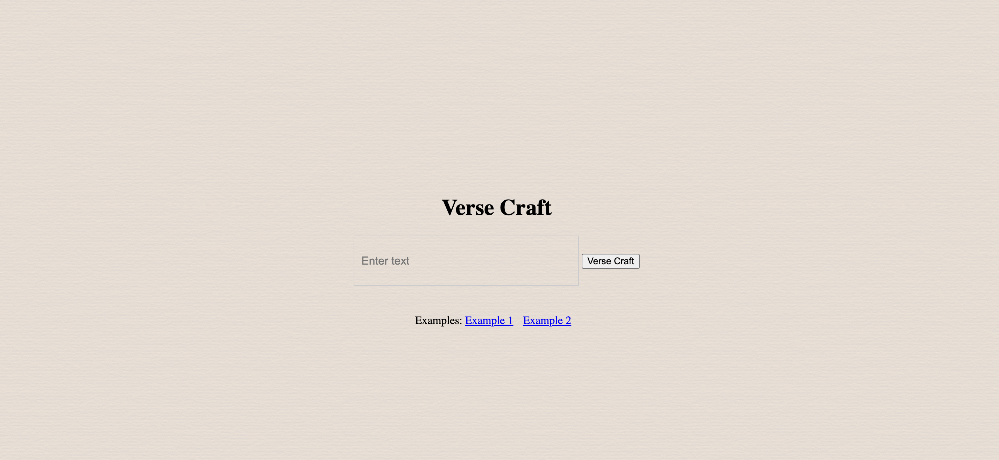

# Verse_Craft

## Overview 
Vesre Craft represents my inaugural venture into the realm of generative AI through NLP-based text generation. This project marks the genesis of my learning journey in this field. I've employed a meticulously curated dataset of 1,6668 poems, along with their titles, which can be accessed on Kaggle. This dataset serves as the foundational material upon which Vesre Craft operates, showcasing the intersection of computational linguistics and artistic expression. Through this endeavor, I aim to explore and expand the boundaries of poetic creation using cutting-edge technology.

## Model Training
In my project, I utilized a dataset featuring two columns: poem names and poem content. Focusing solely on the poem content, I extracted this data into a list to train my model. Employing the GPT-2 model along with the GPT2TokenizerFast for efficient tokenization. Specifically, I trained the model over three epochs for four iterations. This approach allowed me to refine the model's understanding of poetic language and structure, facilitating its ability to generate coherent and stylistically appropriate text.

## Model Deployment

Model was initially deployed into huggingface spaces.
https://huggingface.co/spaces/mmchowdhury/VerseCraft

